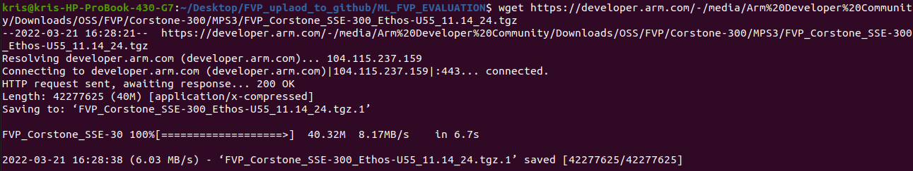

# YOLOv8_on_WE2
This is a repository which step by step teaches you how to use the "Ultralytics Hub" to train your own yolov8n model and deploy it to FVP.
- The first part is [Yolov8n object detection part](https://github.com/HimaxWiseEyePlus/YOLOv8_on_WE2?tab=readme-ov-file#yolov8n-object-detection).
    - At this part will step by step teach you how to use the [Ultralytics Hub](https://hub.ultralytics.com/) to train your own yolov8n object detection model, pass the model using vela compiler with HIMAX WE2 setting.
- The second part is [Yolov8n pose part](https://github.com/HimaxWiseEyePlus/YOLOv8_on_WE2?tab=readme-ov-file#yolov8n-pose).
    - At this part will use the pre-trained model yolov8n-pose and use [DeGirum/ultralytics_yolov8](https://github.com/DeGirum/ultralytics_yolov8) to convert the pre-trained weight to int8 tflite, pass the model using vela compiler with HIMAX WE2 setting.
    - Second, you can also retrain the yolov8n pose model.
- Finally, [deploy YOLOv8n to FVP](https://github.com/HimaxWiseEyePlus/YOLOv8_on_WE2?tab=readme-ov-file#deploy-yolov8n-to-fvp).
    - The example including
        - [Yolov8n object detection](https://github.com/HimaxWiseEyePlus/YOLOv8_on_WE2?tab=readme-ov-file#build-with-yolov8n-object-detection-tflite-model-passing-vela)
        - [Yolov8n object detection delete transpose](https://github.com/HimaxWiseEyePlus/YOLOv8_on_WE2?tab=readme-ov-file#build-with-yolov8n-object-detection-delete-transpose-tflite-model-passing-vela)
        - [Yolov8n pose](https://github.com/HimaxWiseEyePlus/YOLOv8_on_WE2?tab=readme-ov-file#build-with-yolov8n-pose-tflite-model-passing-vela)
# Yolov8n object detection

## Web GUI training
- Web GUI Overview
- Home page 
    
- Provided public dataset (only detection dataset) 
    
- You can also upload your own dataset 
    
- Integrations with the Roboflow which can upload your own data and output yolov8 data format 
    
    
- Create project page 
    
- Models which you trained or pre-trained 
    
- GUI training on your own 
- Create your own project 
    
- Create model 
    
- Select provided dataset 
    
- Set model setting 
    - Please choose Yolov8n (n: nano is the smallest model at Yolov8 series) and use pre-trained model 
        
- Set training setting 
    - Scroll down to set the advance setting 
        - Please set input size to 192, which can fulfill the HIMAX WE2 setting 
            
    - Connect to your own training resource
        - Google Colab 
            
            - please copy the Colab code 
            - open Google Colab and paste on Google Colab
        - Bring to your own agent 
            
            - Please pip install the `Ultralytics` package
            - Create the python file and paste the python code
            - Execute python file
- See the training progress on the Web 
    

## Export yolov8n object detection pytorch model to int8 tflite
- After training process is done, then you will get the `best.pt` which is the pytorch model.
- Use python code to export it to int8 tflite (full interger quant) by Ultralytics export API
    - If your training dataset is another, you should change the data yaml file.
        ```
        from ultralytics import YOLO

        # # Load a model
        image_size = 192

        model = YOLO("best.pt")  

        model.export(format="tflite", imgsz = image_size, int8 = True, data="SKU-110K.yaml")

        ```
    - We use provided dataset `SKU-110K` for retail detect 
        
    - The output int8 tflite model will be called `*_full_integer_quant.tflite`
    - You can also use [yolov8n object detection pre-trained weight](https://github.com/ultralytics/assets/releases/download/v0.0.0/yolov8n.pt), which is output COCO 80 class.
        ```
        from ultralytics import YOLO

        # # Load a model
        image_size = 192

        model = YOLO("yolov8n.pt")  

        model.export(format="tflite", imgsz = image_size, int8 = True, data="coco128.yaml")

        ```

## How to use HIMAX config file to generate vela model
- You can reference [here](https://github.com/HimaxWiseEyePlus/ML_FVP_EVALUATION?tab=readme-ov-file#how-to-use-himax-config-file-to-generate-vela-model).
- Go under vela folder
    ```
    cd vela
    ```
- Install necessary package:
    ```
    pip install ethos-u-vela
    ```
- Run vela with himax config ini file with mac=64 and the yolov8n object detect example tflite model
    ```
    vela --accelerator-config ethos-u55-64 --config himax_vela.ini --system-config My_Sys_Cfg --memory-mode My_Mem_Mode_Parent --output-dir ./img_yolov8_192 ./img_yolov8_192/yolov8n_full_integer_quant_size_192.tflite
    ```
- You will see the vela report on the terminal: : (Notes: `Total SRAM used` less than `1MB` will be better)
    - There are 5 transpose ops leak out the vela compiler, and it will be fall back to run on Cortex-M55 CPU. 
    

## Export yolov8n object detection pytorch model to int8 tflite and delete 4 transpose ops
- If there are many transpose OP run on CPU, it will be slow.
- At the [Ultralytics](https://github.com/ultralytics/ultralytics) repositroy, it use [PINTO0309's onnx2tf](https://github.com/PINTO0309/onnx2tf) tool to convert the onnx model to int8 tflite.
- First, we can convert pytroch to onnx model.
- Second, add the following command at the `ultralytics repository v8.0.173` (https://github.com/ultralytics/ultralytics/blob/v8.0.173/ultralytics/engine/exporter.py#L690) which use `onnx2tf` cli command to convert the tflite and at latest version [it](https://github.com/ultralytics/ultralytics/blob/main/ultralytics/engine/exporter.py#L1080) use onnx2tf.convert function. (please reference the tutorial [here](https://github.com/PINTO0309/onnx2tf?tab=readme-ov-file#parameter-replacement))
    ```
     -prf {param_replacement.json} -rtpo 
    ```
    - We give the example here, `replace_192_80cls_transpose_op.json`, but there are something should be changed under following condition.
        1. Be careful, the `op_name` and `param_name` should be changed if needed, depending on the `op_name` and `param_name` of your converted `onnx file` . 
        2. If your output class is not 80, you should modify `replace_192_80cls_transpose_op.json` to replace `144` value to `64+{class_num}`. For example, class_num is `1`, you should modify `replace_192_80cls_transpose_op.json` to replace `144` value to `65`, and then it could be correct.
- Finally, you can delete 4 `transpose op`, at final int8 tflite.
    - original tflite which pass vela
         
    - delete 4 transpose tflite which pass vela
         

# Yolov8n pose
## Export yolov8n pose pytorch model to int8 tflite
- We use [DeGirum/ultralytics_yolov8](https://github.com/DeGirum/ultralytics_yolov8) to convert the [yolov8n pose pre-trained weight](https://github.com/ultralytics/assets/releases/download/v0.0.0/yolov8n-pose.pt) to int8 tflite.
    - Prerequisites
    ```
    #create python virtual environment
    python3 -m venv ultralytics_yolov8_venv

    #activate ultralytics_yolov8_venv
    source ultralytics_yolov8_venv/bin/activate
    
    pip install tensorflow==2.13.1
    pip install onnx2tf==1.15.4
    pip install -U onnx==1.15.0 \
    && pip install -U nvidia-pyindex \
    && pip install -U onnx-graphsurgeon \
    && pip install -U onnxruntime==1.16.3 \
    && pip install -U onnxsim==0.4.33 \
    && pip install -U simple_onnx_processing_tools \
    && pip install -U onnx2tf \
    && pip install -U h5py==3.7.0 \
    && pip install -U psutil==5.9.5 \
    && pip install -U ml_dtypes==0.2.0

    git clone https://github.com/DeGirum/ultralytics_yolov8
    cd ultralytics_yolov8

    #install ultralytics_yolov8 package
    pip install -e .
    
    cd ..
    ```
    - Export command
    ```
    python dg_export_int8_output.py --weights="yolov8n-pose.pt"  --img=192
    #or
    python dg_export_int8_output.py --weights="yolov8n-pose.pt"  --img=256
    ```
- The [DeGirum/ultralytics_yolov8](https://github.com/DeGirum/ultralytics_yolov8) repository exporting a YOLOv8n pose model with 7 separate outputs improved performance in quantized model.

## Retrain yolov8n pose pytorch model and export it to int8 tflite
- You can train the yolov8n pose model on your own PC.
    ```
    python dg_train_pose.py --weights="yolov8n-pose.pt"  --img=256
    ```
- After training process is done, then you will get the `best.pt` which is the pytorch model. Next, it will automatically generate the `best_save_model/best_full_integer_quant.tflite`. Just generate the vela model by passing the `best_save_model/best_full_integer_quant.tflite` to vela compiler, and you can run the model which you retrain on WE2.
    

## How to use HIMAX config file to generate vela model
- You can reference [here](https://github.com/HimaxWiseEyePlus/ML_FVP_EVALUATION?tab=readme-ov-file#how-to-use-himax-config-file-to-generate-vela-model).
- Go under vela folder
```
cd vela
```
- Install necessary package:
```
pip install ethos-u-vela
```
- Run vela with himax config ini file with mac=64 and the yolov8n pose example tflite model
```
vela --accelerator-config ethos-u55-64 --config himax_vela.ini --system-config My_Sys_Cfg --memory-mode My_Mem_Mode_Parent --output-dir ./img_yolov8_pose_192 ./img_yolov8_pose_192/yolov8n-pose_full_integer_quant.tflite
```
- You will see the vela report on the terminal: (Notes: `Total SRAM used` less than `1MB` will be better)
    - There are 4 transpose ops leak out the vela compiler, and it will be fall back to run on Cortex-M55 CPU. 
    

# Deploy YOLOv8n to FVP
## Prerequisites
- To run evaluations using this software, we suggest using Ubuntu 20.04 LTS environment.
- Install the toolkits listed below:
    - Install necessary packages:
        ```
        sudo apt-get update

        sudo apt-get install cmake

        sudo apt-get install curl

        sudo apt install xterm

        sudo apt install python3

        sudo apt install python3.8-venv

        sudo apt-get install libpython3.8-dev
        ```
    - Corstone SSE-300 FVP: aligned with the Arm MPS3 development platform and includes both the Cortex-M55 and the Ethos-U55 processors.
        ```
        # Fetch Corstone SSE-300 FVP
        wget https://developer.arm.com/-/media/Arm%20Developer%20Community/Downloads/OSS/FVP/Corstone-300/MPS3/FVP_Corstone_SSE-300_Ethos-U55_11.14_24.tgz
        ```

        

        ```
        # Create folder to be extracted
        mkdir temp
        # Extract the archive
        tar -C temp -xvzf FVP_Corstone_SSE-300_Ethos-U55_11.14_24.tgz
        ```

        

        ```
        # Execute the self-install script
        temp/FVP_Corstone_SSE-300_Ethos-U55.sh --i-agree-to-the-contained-eula --no-interactive -d CS300FVP
        ```

        

    - GNU Arm Embedded Toolchain 10-2020-q4-major is the only version supports Cortex-M55.
        ```
        # fetch the arm gcc toolchain.
        wget https://developer.arm.com/-/media/Files/downloads/gnu-rm/10-2020q4/gcc-arm-none-eabi-10-2020-q4-major-x86_64-linux.tar.bz2

        # Extract the archive
        tar -xjf gcc-arm-none-eabi-10-2020-q4-major-x86_64-linux.tar.bz2

        # Add gcc-arm-none-eabi/bin into PATH environment variable.
        export PATH="${PATH}:/[location of your GCC_ARM_NONE_EABI_TOOLCHAIN_ROOT]/gcc-arm-none-eabi/bin"
        ```
    - Arm ML embedded evaluation kit Machine Learning (ML) applications targeted for Arm Cortex-M55 and Arm Ethos-U55 NPU.
        - We use Arm ML embedded evaluation kit to run the Yolov8n FVP example.
            ```
            # Fetch Arm ML embedded evaluation kit
            wget https://review.mlplatform.org/plugins/gitiles/ml/ethos-u/ml-embedded-evaluation-kit/+archive/refs/tags/22.02.tar.gz

            mkdir ml-embedded-evaluation-kit
            tar -C ml-embedded-evaluation-kit  -xvzf 22.02.tar.gz
            cp -r ./source/application/main/include ./ml-embedded-evaluation-kit/source/application/main
            cp -r ./source/application/tensorflow-lite-micro/include ./ml-embedded-evaluation-kit/source/application/tensorflow-lite-micro
            cp -r ./source/profiler/include ./ml-embedded-evaluation-kit/source/profiler
            cp -r ./source/use_case/ad/include ./ml-embedded-evaluation-kit/source/use_case/ad
            cp -r ./source/use_case/asr/include ./ml-embedded-evaluation-kit/source/use_case/asr
            cp -r ./source/use_case/img_class/include ./ml-embedded-evaluation-kit/source/use_case/img_class
            cp -r ./source/use_case/inference_runner/include ./ml-embedded-evaluation-kit/source/use_case/inference_runner
            cp -r ./source/use_case/kws/include ./ml-embedded-evaluation-kit/source/use_case/kws
            cp -r ./source/use_case/kws_asr/include ./ml-embedded-evaluation-kit/source/use_case/kws_asr
            cp -r ./source/use_case/noise_reduction/include ./ml-embedded-evaluation-kit/source/use_case/noise_reduction
            cp -r ./source/use_case/object_detection/include ./ml-embedded-evaluation-kit/source/use_case/object_detection
            cp -r ./source/use_case/vww/include ./ml-embedded-evaluation-kit/source/use_case/vww
            cp -r download_dependencies.py ./ml-embedded-evaluation-kit/
            cp -r set_up_default_resources.py ./ml-embedded-evaluation-kit/
            cp -r gen_rgb_cpp.py ./ml-embedded-evaluation-kit/scripts/py/
            cp -r requirements.txt ./ml-embedded-evaluation-kit/scripts/py/
            cd ml-embedded-evaluation-kit/
            rm -rf ./dependencies
            python3 ./download_dependencies.py
            ./build_default.py --npu-config-name ethos-u55-64
            #go out ml-embedded-evaluation-kit folder and copy the example resources to ML embedded evaluation kit
            cd ..
            cp -r ./resources/img_yolov8_192 ./ml-embedded-evaluation-kit/resources
            cp -r ./source/use_case/img_yolov8_192 ./ml-embedded-evaluation-kit/source/use_case
            cp -r ./vela/img_yolov8_192 ./ml-embedded-evaluation-kit/resources_downloaded/

            cp -r ./resources/img_yolov8_192_delete_transpose ./ml-embedded-evaluation-kit/resources
            cp -r ./source/use_case/img_yolov8_192_delete_transpose ./ml-embedded-evaluation-kit/source/use_case
            cp -r ./vela/img_yolov8_192_delete_transpose ./ml-embedded-evaluation-kit/resources_downloaded/
            
            cp -r ./resources/img_yolov8_pose_192 ./ml-embedded-evaluation-kit/resources
            cp -r ./source/use_case/img_yolov8_pose_192 ./ml-embedded-evaluation-kit/source/use_case
            cp -r ./vela/img_yolov8_pose_192 ./ml-embedded-evaluation-kit/resources_downloaded/

            cp -r ./resources/img_yolov8_pose_256 ./ml-embedded-evaluation-kit/resources
            cp -r ./source/use_case/img_yolov8_pose_256 ./ml-embedded-evaluation-kit/source/use_case
            cp -r ./vela/img_yolov8_pose_256 ./ml-embedded-evaluation-kit/resources_downloaded/
            ```
## Build with Yolov8n Object detection tflite model passing vela
- Go under folder of ml-embedded-evaluation-kit
    ```
    cd ml-embedded-evaluation-kit
    ```
- First, Create the output file and go under the folder
    ```
    mkdir build_img_yolov8_192 && cd build_img_yolov8_192
    ```

- Second, Configure the Yolov8n Object detection example and set ETHOS_U_NPU_ENABLED to be ON.And you can run with Ethos-U55 NPU.
    ```
    cmake ../ -DUSE_CASE_BUILD=img_yolov8_192 \-DETHOS_U_NPU_ENABLED=ON
    ```
- Compile the Yolov8n Object detection example
    ```
    make -j8
    ```
## Run with Yolov8n Object detection tflite model and inference using Ethos-U55 NPU and m55
- Go out and under the folder of YOLOv8_on_WE2
    ```
    cd ../../
    ```
- Run with the commad about
    ```
    CS300FVP/models/Linux64_GCC-6.4/FVP_Corstone_SSE-300_Ethos-U55 -C ethosu.num_macs=64 ml-embedded-evaluation-kit/build_img_yolov8_192/bin/ethos-u-img_yolov8_192.axf
    ```
    Be careful of the `ethosu.num_macs` number of the MACS at the command. If you use missmatch MACS number with vela model, it will be invoke fail. 
- You with see the FVP telnetterminal result below:
- Start inference: 
    - You will see the input size, output tensor size and MACS size on telnetterminal.
    - The tflite op has run with the ethos-u op.
    
- Run inference: 
    - key-in `1` on telnetterminal and you will start to inference first image with Ethos-U55 NPU and Cortex-M55. 
    
    - First, you will see the input image on the screen.
    - Then, you will see the detection result with bbox and class on the screen.
    

## Build with Yolov8n Object detection delete transpose tflite model passing vela
- Go under folder of ml-embedded-evaluation-kit
    ```
    cd ml-embedded-evaluation-kit
    ```
- First, Create the output file and go under the folder
    ```
    mkdir build_img_yolov8_192_delete_transpose && cd build_img_yolov8_192_delete_transpose
    ```

- Second, Configure the Yolov8n Object detection delete transpose example and set ETHOS_U_NPU_ENABLED to be ON.And you can run with Ethos-U55 NPU.
    ```
    cmake ../ -DUSE_CASE_BUILD=img_yolov8_192_delete_transpose \-DETHOS_U_NPU_ENABLED=ON
    ```
- Compile the Yolov8n Object detection delete transpose example
    ```
    make -j8
    ```
## Run with Yolov8n Object detection delete transpose tflite model and inference using Ethos-U55 NPU and m55
- Go out and under the folder of YOLOv8_on_WE2
    ```
    cd ../../
    ```
- Run with the commad about
    ```
    CS300FVP/models/Linux64_GCC-6.4/FVP_Corstone_SSE-300_Ethos-U55 -C ethosu.num_macs=64 ml-embedded-evaluation-kit/build_img_yolov8_192_delete_transpose/bin/ethos-u-img_yolov8_192_delete_transpose.axf
    ```
    Be careful of the `ethosu.num_macs` number of the MACS at the command. If you use missmatch MACS number with vela model, it will be invoke fail. 
- You with see the FVP telnetterminal result below:
- Start inference: 
    - You will see the input size, output tensor size and MACS size on telnetterminal.
    - The tflite op has run with the ethos-u op.
    
- Run inference: 
    - key-in `1` on telnetterminal and you will start to inference first image with Ethos-U55 NPU and Cortex-M55. 
    
    - First, you will see the input image on the screen.
    - Then, you will see the detection result with bbox and class on the screen.
    


## Build with Yolov8n pose tflite model passing vela
- Go under folder of ml-embedded-evaluation-kit
    ```
    cd ml-embedded-evaluation-kit
    ```
- First, Create the output file and go under the folder
    ```
    mkdir build_img_yolov8_pose_192 && cd build_img_yolov8_pose_192
    ```

- Second, Configure the Yolov8n pose example and set ETHOS_U_NPU_ENABLED to be ON.And you can run with Ethos-U55 NPU.
    ```
    cmake ../ -DUSE_CASE_BUILD=img_yolov8_pose_192 \-DETHOS_U_NPU_ENABLED=ON
    ```
- Compile the Yolov8n pose example
    ```
    make -j8
    ```
## Run with Yolov8n pose tflite model and inference using Ethos-U55 NPU and m55
- Go out and under the folder of YOLOv8_on_WE2
    ```
    cd ../../
    ```
- Run with the commad about
    ```
    CS300FVP/models/Linux64_GCC-6.4/FVP_Corstone_SSE-300_Ethos-U55 -C ethosu.num_macs=64 ml-embedded-evaluation-kit/build_img_yolov8_pose_192/bin/ethos-u-img_yolov8_pose_192.axf
    ```
    Be careful of the `ethosu.num_macs` number of the MACS at the command. If you use missmatch MACS number with vela model, it will be invoke fail. 
- You with see the FVP telnetterminal result below:
- Start inference: 
    - You will see the input size, output tensor size and MACS size on telnetterminal.
    - The tflite op has run with the ethos-u op.
    
    
- Run inference: 
    - key-in `1` on telnetterminal and you will start to inference first image with Ethos-U55 NPU and Cortex-M55. 
    
    - First, you will see the input image on the screen.
    - Then, you will see the detection result with bbox and pose key-points on the screen.
    


## Build with Yolov8n pose tflite model (input size = 256) passing vela
- Go under folder of ml-embedded-evaluation-kit
    ```
    cd ml-embedded-evaluation-kit
    ```
- First, Create the output file and go under the folder
    ```
    mkdir build_img_yolov8_pose_256 && cd build_img_yolov8_pose_256
    ```

- Second, Configure the Yolov8n pose example and set ETHOS_U_NPU_ENABLED to be ON.And you can run with Ethos-U55 NPU.
    ```
    cmake ../ -DUSE_CASE_BUILD=img_yolov8_pose_256 \-DETHOS_U_NPU_ENABLED=ON
    ```
- Compile the Yolov8n pose example
    ```
    make -j8
    ```
## Run with Yolov8n pose tflite model (input size = 256) and inference using Ethos-U55 NPU and m55
- Go out and under the folder of YOLOv8_on_WE2
    ```
    cd ../../
    ```
- Run with the commad about
    ```
    CS300FVP/models/Linux64_GCC-6.4/FVP_Corstone_SSE-300_Ethos-U55 -C ethosu.num_macs=64 ml-embedded-evaluation-kit/build_img_yolov8_pose_256/bin/ethos-u-img_yolov8_pose_256.axf
    ```
    Be careful of the `ethosu.num_macs` number of the MACS at the command. If you use missmatch MACS number with vela model, it will be invoke fail. 

# Reference
1. https://github.com/ultralytics/ultralytics
2. https://github.com/PINTO0309/onnx2tf
3. https://github.com/DeGirum/ultralytics_yolov8
